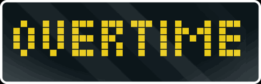
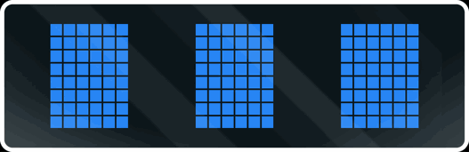

# clocket-league

**Your live Rocket League match on a pixel clock.** Score in team colors with the
in-game clock, a blinking **GOAL!** in the scorer's color, **POST** when you ring
the crossbar, overtime that counts up as **+0:42**, and a **BLUE WINS!** finish —
with a little car that drives the ball in at kickoff and away at the whistle.

No tracker account, no cloud, no browser — it reads Rocket League's *own* local
Stats API and talks straight to your clock over your LAN.

<p align="center"></p>

---

## Every screen

Captured straight off an Ulanzi TC001.

| | |
|---|---|
|  | **Kickoff** — your team's car drives the ball in (the only car before the game) |
|  | **Countdown** — `3 · 2 · 1 · GO!` |
|  | **Score + clock** — score in team colors, clock ticking |
|  | **Score** — on its own |
|  | **Clock** — gray, **amber** under 1:00, **red** in the final 10s |
|  | **Goal** — `GOAL!` blinks in the scorer's color (blue) |
|  | **Goal** — …or orange |
|  | **Post** — you rang the crossbar |
|  | **Overtime** — `OVERTIME`, then `+0:0x` counting up |
|  | **Your boost** — fills L→R with the % on it |
|  | **Teammates' boost** — vertical bars, fill bottom→top |
|  | **Final** — `BLUE WINS!` and the score |
|  | **Whistle** — the winner's car drives the ball away |

---

## Prerequisites

1. **An AWTRIX 3 clock** — an [Ulanzi TC001](https://www.ulanzi.com/products/ulanzi-pixel-smart-clock-2882)
   (~$60) or any 32×8 AWTRIX device, on your WiFi. Flash AWTRIX 3 and note its IP:
   <https://blueforcer.github.io/awtrix3/>
2. **Rocket League on a PC** (Steam or Epic — the Stats API is PC-only).
3. **Python 3.9+** on that PC. The default setup needs **no extra packages**.

## Install

```bash
git clone https://github.com/brendanwelsh/clocket-league
cd clocket-league
```

## Turn on Rocket League's Stats API (one time)

Edit (create if missing) `<RL install>\TAGame\Config\DefaultStatsAPI.ini`:

```ini
[StatsAPI]
Port=49123
PacketSendRate=30
```

Then **restart Rocket League**. Official Psyonix API —
<https://www.rocketleague.com/en/developer/stats-api>.

## Run

```bash
python clocket_league.py --clock-host 192.168.1.50
```

Use your clock's IP, then play. Prefer a file? Copy `.env.example` to `.env`.

**See it without Rocket League:** `--source demo` plays a scripted match;
`--source showcase` tours every screen.

---

## Configuration — what's togglable and how

Every flag is also an env var / `.env` key (see [`.env.example`](.env.example)).

| Flag | What it does | Default |
|---|---|---|
| `--clock-host IP` | your AWTRIX clock (for `--transport http`) | — |
| `--source` | `rl` (RL's socket) · `ballshark` (tracker WS) · `demo` · `showcase` | `rl` |
| `--transport` | `http` (straight to the clock) · `mqtt` (via a broker) | `http` |
| `--screens` | what the steady display shows — a comma list it rotates through (see below) | `score-time` |
| `--swap-secs` | seconds per screen when `--screens` lists more than one | `10` |
| `--disable` | turn features off: `countdown,goal,post,overtime,urgency` | none |
| `--team-names` | `normalize` (BLUE/ORANGE WINS) · `actual` (real lobby name) | `normalize` |
| `--player-name` | your in-game name — needed for the boost screens | — |

### `--screens` — pick your steady display

It rotates through whatever you list, `--swap-secs` apart:

| value | shows |
|---|---|
| `score-time` | score **and** clock together |
| `score` | just the score |
| `time` | just the clock |
| `boost` | **your** boost (L→R bar with %) |
| `boost-team` | **teammates'** boost (vertical bars) |

```bash
--screens score,time                    # swap score / clock every 10s
--screens boost                         # just your boost, all game
--screens score-time,boost,boost-team   # cycle all three
```

### `--disable` — turn off what you don't want

`countdown` (the kickoff 3-2-1) · `goal` (the GOAL! banner) · `post` (crossbar) ·
`overtime` (the OT banner) · `urgency` (the amber/red clock). e.g.
`--disable post,urgency`.

### Sources & transports

- **`--source rl`** reads RL's local Stats API socket — nothing else needed.
- **`--source ballshark`** reads a running [ballshark](https://github.com/brendanwelsh/ballshark)
  tracker (so two programs don't fight over RL's socket). Needs `pip install websocket-client`.
- **`--transport mqtt`** publishes to a broker the clock listens on. Needs `pip install paho-mqtt`.

**Keep it running:** [`run.bat`](run.bat) (Windows) or
[`clocket-league.service`](clocket-league.service) (Linux systemd).

---

## How it works

RL streams JSON events on a local socket while you play; clocket-league watches
the score, clock, goals, crossbar hits, and start/end, and paints one held
notification on your clock — a full-screen takeover that clears between matches.
The GIFs above were captured with [`tools/capture_gifs.py`](tools/capture_gifs.py)
straight from the clock's `/api/screen`. Deep dive: **[docs/TECHNICAL.md](docs/TECHNICAL.md)**.

## FAQ

- **Needs BakkesMod?** No — official Psyonix Stats API.
- **Console?** No — the Stats API is PC-only.
- **`connection refused`?** RL isn't running, or `PacketSendRate=0`. Re-check the setup step.

---

Not affiliated with Psyonix or Epic Games. "Rocket League" is their trademark.
MIT licensed — see [LICENSE](LICENSE).
