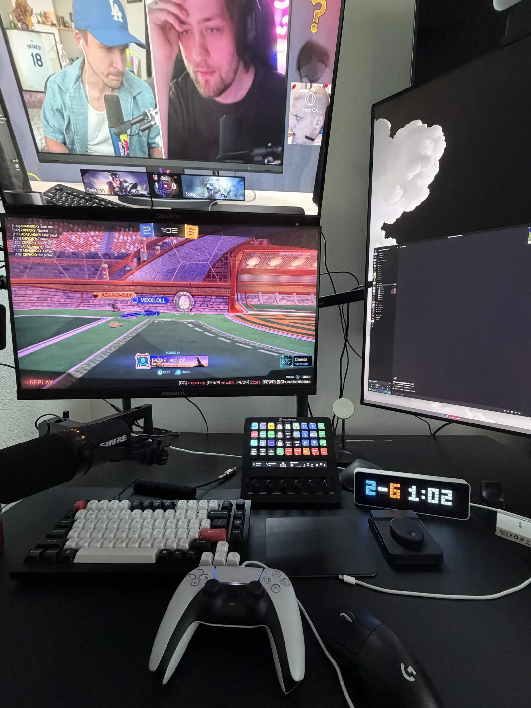
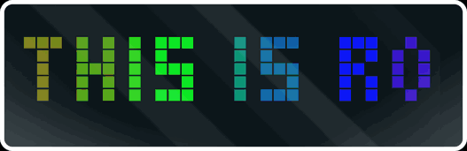
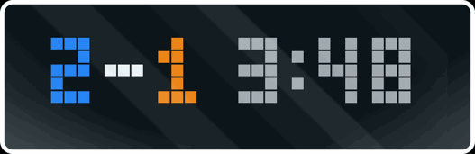
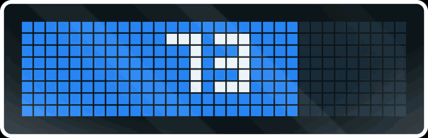
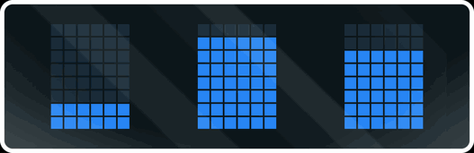

# clocket-league

**Your live Rocket League match on a pixel clock.** Turn an
**[Ulanzi TC001](https://www.ulanzi.com/products/ulanzi-pixel-smart-clock-2882)**
running **[AWTRIX 3](https://blueforcer.github.io/awtrix3/)** into a live RL
scoreboard: score in team colors with the in‑game clock, a blinking **GOAL!** in
the scorer's color, **POST** on the crossbar, overtime counting up as **+0:42**,
and a **BLUE WINS!** finish — with a little car that drives the ball in at kickoff
and away at the whistle.

This only became possible when Psyonix shipped Rocket League's **official
[Stats API](https://www.rocketleague.com/en/developer/stats-api)** — a local data
feed the game can emit on your own PC. clocket-league reads that feed directly and
talks straight to your clock over your home WiFi. No account, no cloud, no website.

<p align="center">
  <br>
  <sub><i>The TC001 on a real desk, mid‑match — blue 2, orange 6, 1:02 on the clock.</i></sub>
</p>

---

## What is this?

clocket-league turns a small desk **pixel clock** into a **live Rocket League
scoreboard**. While you're in a match, the clock drops its normal time/weather
display and shows the live score, the game clock, goals, overtime and boost —
then goes back to being a clock when the match ends. It runs quietly on your
gaming PC while you play; you set it up once and forget about it.

### What you need

- **A pixel clock** — an **[Ulanzi TC001](https://www.ulanzi.com/products/ulanzi-pixel-smart-clock-2882)**
  (~$60; a 32×8 RGB-LED "smart pixel clock"), running the free, open-source
  **[AWTRIX 3](https://blueforcer.github.io/awtrix3/)** firmware. You flash AWTRIX 3
  onto it once, right from your browser — see [Setup](#setup). (Any 32×8 AWTRIX
  device works; the TC001 is the popular one.)
- **Rocket League on a Windows PC** — the Stats API is **PC-only** (no consoles).
- **Python 3.9+** on that PC. The default mode needs **no extra Python packages**.

Total one-time setup is ~5 minutes: flash the clock, flip on RL's Stats API, run it.

---

## Every screen

Captured straight off an Ulanzi TC001.

| | |
|---|---|
|  | **Launch** — `THIS IS ROCKET LEAGUE!` 🌈 → `WAITING FOR MATCH` |
|  | **Kickoff** — your team's car drives the ball in |
|  | **Countdown** — `3 · 2 · 1 · GO!` |
|  | **Score + clock** — score in team colors, clock ticking |
|  | **Score** — on its own |
|  | **Clock** — plenty of time (gray) |
|  | **Clock** — **amber** under 1:00 |
|  | **Clock** — **red & blinking** in the final 10 seconds |
|  | **Overtime** — `OVERTIME`, then `+0:0x` counting up (gold) |
|  | **Goal** — `GOAL!` blinks in the scorer's color (blue) |
|  | **Goal** — …or orange |
|  | **Post** — you rang the crossbar |
|  | **Your boost** — fills L→R with the % on it |
|  | **Teammates' boost** — vertical bars, fill bottom→top |
|  | **Final** — `BLUE WINS!` and the score |
|  | **MVP** — `YOU'RE MVP!` (or `MVP <name>` for the winning team's top scorer) |
|  | **Whistle** — the winner's car drives the ball away |

---

## Setup

Three one-time steps:

1. **Flash AWTRIX 3 onto the clock.** Plug the TC001 in via USB‑C and use the
   official browser flasher at <https://blueforcer.github.io/awtrix3/> — it walks
   you through it. Connect it to WiFi and note the **IP address** it shows.

2. **Turn on Rocket League's Stats API.** Add these lines to
   `…\rocketleague\TAGame\Config\DefaultStatsAPI.ini` (create it if missing), then
   restart RL:

   ```ini
   [StatsAPI]
   Port=49123
   PacketSendRate=30
   ```

3. **Run it.** With [Python 3.9+](https://www.python.org/downloads/) installed,
   grab this repo (`git clone`, or **Code → Download ZIP**) and run it with your
   clock's IP:

   ```bash
   python clocket_league.py --clock-host 192.168.1.50
   ```

Then play. To preview it without Rocket League, add `--source demo`.

---

## Configuration — what's togglable and how

Every flag is also an env var / `.env` key (see [`.env.example`](.env.example)).

| Flag | What it does | Default |
|---|---|---|
| `--clock-host IP` | your AWTRIX clock (for `--transport http`) | — |
| `--source` | `rl` (RL's Stats API socket) · `demo` · `showcase` | `rl` |
| `--transport` | `http` (straight to the clock) · `mqtt` (via a broker) | `http` |
| `--screens` | what the steady display shows — a comma list it rotates through (see below) | `score-time` |
| `--swap-secs` | seconds per screen when `--screens` lists more than one | `10` |
| `--disable` | turn features off: `greeting,countdown,goal,post,overtime,urgency` | none |
| `--team-names` | `normalize` (BLUE/ORANGE WINS) · `actual` (real lobby name) | `normalize` |
| `--player-name` | your in-game name — needed for the boost screens | — |

### `--screens` — pick your steady display

It rotates through whatever you list, `--swap-secs` apart:

| value | shows |
|---|---|
| `score-time` | score **and** clock together |
| `score` | just the score |
| `time` | just the clock |
| `boost` | **your** boost (L→R bar with %) |
| `boost-team` | **teammates'** boost (vertical bars) |

```bash
--screens score,time                    # swap score / clock every 10s
--screens boost                         # just your boost, all game
--screens score-time,boost,boost-team   # cycle all three
```

### `--disable` — turn off what you don't want

`greeting` (the "THIS IS ROCKET LEAGUE!" launch screen) · `countdown` (the kickoff
3-2-1) · `goal` (the GOAL! banner) · `post` (crossbar) · `overtime` (the OT banner)
· `urgency` (the amber/red clock). e.g. `--disable post,urgency`.

### Transports

- **`--transport http`** (default) posts straight to the clock — nothing else needed.
- **`--transport mqtt`** publishes to a broker the clock listens on. Needs `pip install paho-mqtt`.

**Keep it running:** [`run.bat`](run.bat) (Windows) or
[`clocket-league.service`](clocket-league.service) (Linux systemd).

---

## How it works

RL streams JSON events on a local socket while you play; clocket-league watches
the score, clock, goals, crossbar hits, and start/end, and paints one held
notification on your clock — a full-screen takeover that clears between matches.
The GIFs above were captured with [`tools/capture_gifs.py`](tools/capture_gifs.py)
straight from the clock's `/api/screen`. Deep dive: **[docs/TECHNICAL.md](docs/TECHNICAL.md)**.

## FAQ

- **Needs BakkesMod?** No — official Psyonix Stats API.
- **Console?** No — the Stats API is PC-only.
- **`connection refused`?** RL isn't running, or `PacketSendRate=0`. Re-check the setup step.

---

Not affiliated with Psyonix or Epic Games. "Rocket League" is their trademark.
MIT licensed — see [LICENSE](LICENSE).
